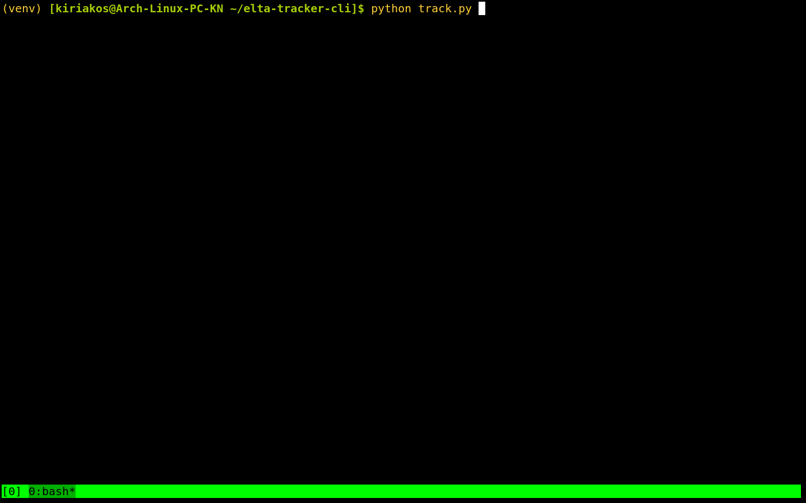

# elta-tracker-cli



### Install dependencies and run

#### Create and activate a Python virtual invorment

Virtual enviroment
```
Python -m venv venv
source venv/bin/activate
```
Install dependencies
```
pip install -r requirements.py
```

Run
```
python track.py
```
